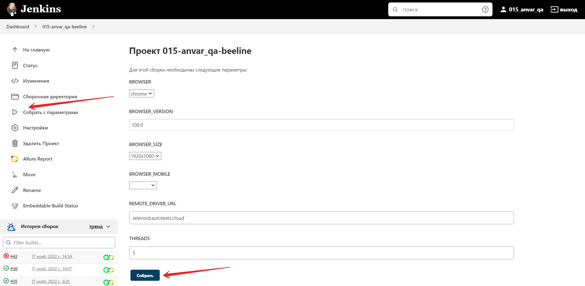
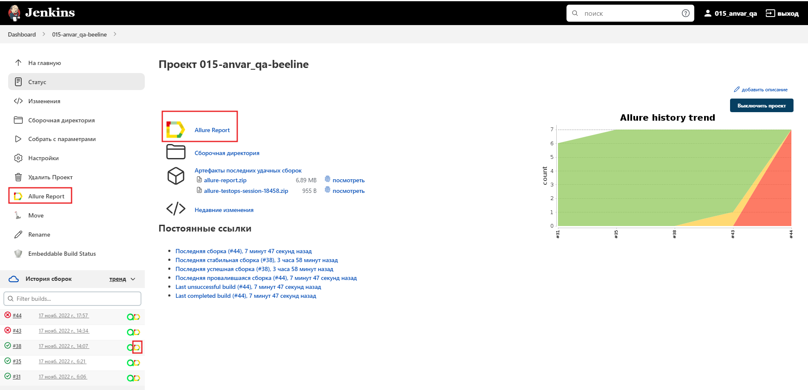
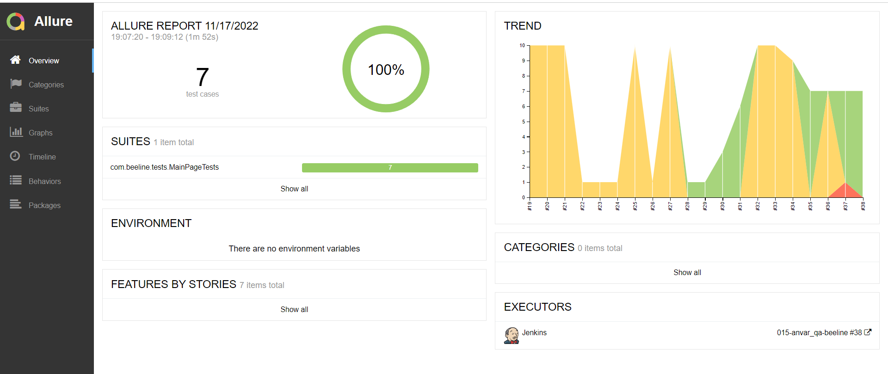
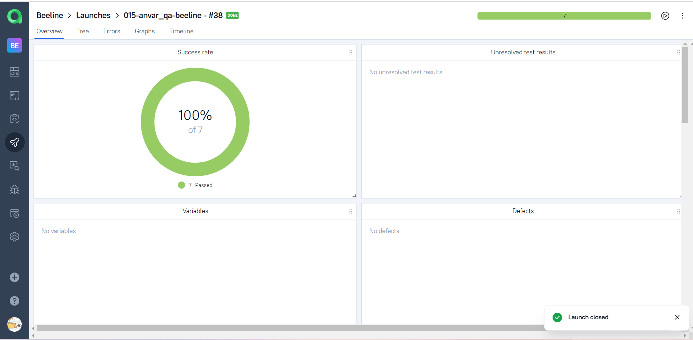
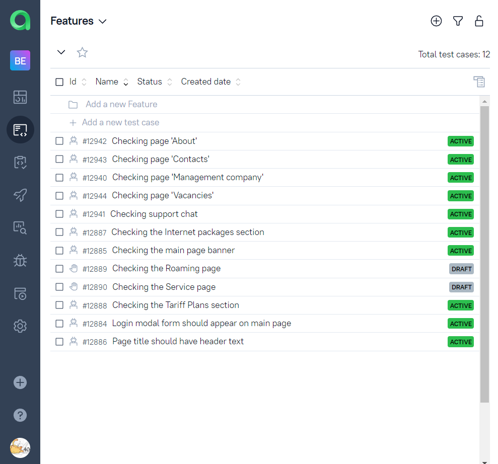
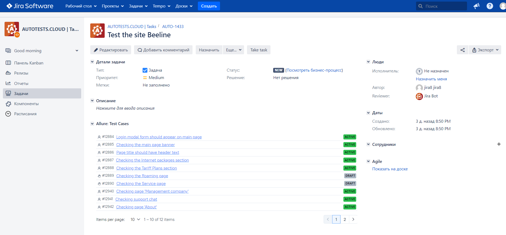
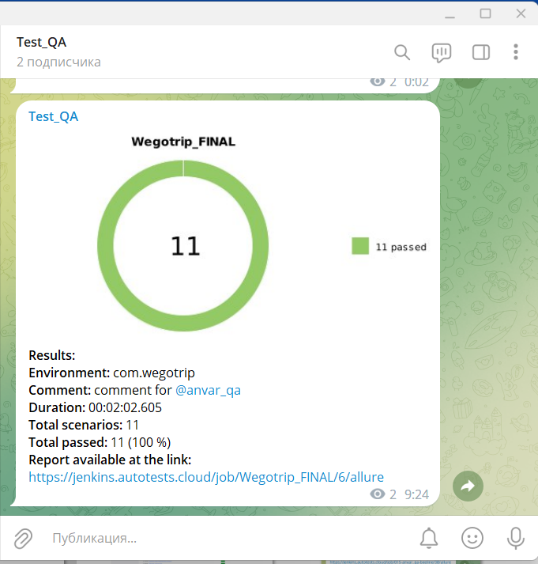
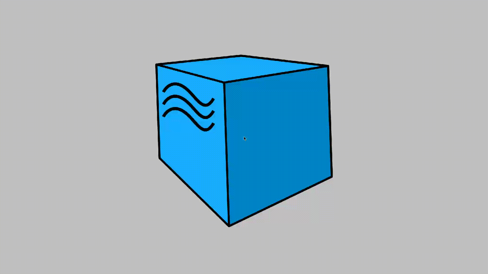

# Test automation project for service WeGoTrip


> WeGoTrip is the best travel app with audio guide to pass\
> self guided walking tours and to buy tickets to museums of the world\
> with personal skip the line or fast-track access.

## :page_with_curl:	Table of contents

> :heavy_check_mark: [Tools and technologies](#Technology)
>
> :heavy_check_mark: [Implemented checks](#Implemented checks)
>
> :heavy_check_mark: [Running tests from the terminal](#computer-Running tests from the terminal)
>
> :heavy_check_mark: [Run tests in Jenkins](#-Run tests in Jenkins)
>
> :heavy_check_mark: [Test results report in Allure Report](#-Test results report in Allure Report)
> 
> :heavy_check_mark: [Integration with Allure TestOps](#-Integration with Allure TestOps)
> 
> :heavy_check_mark: [Integration with Jira](#-Integration with Jira)
>
> :heavy_check_mark: [Notifications in Telegram using bot](#-Notifications in Telegram using bot)
>
> :heavy_check_mark: [Example of running test in Selenoid](#-Example of running test in Selenoid)

## :technologist: Tools and technologies

<p  align="center"

<code></code>
<code></code>
<code></code>
<code></code>
<code></code>
<code></code>
<code></code>
<code></code>
<code></code>
<code></code>
<code></code>
<code></code>
</p>

> *В данном проекте автотесты написаны на <code><strong>*Java*</strong></code> с использованием фреймворка <code><strong>*Selenide*</strong></code> для UI-тестов.*
>
>*Для сборки проекта используется <code><strong>*Gradle*</strong></code>.*
>
>*<code><strong>*JUnit 5*</strong></code> используется как фреймворк для модульного тестирования.*
>
>*Запуск тестов выполняется из <code><strong>*Jenkins*</strong></code>.*
>
>*<code><strong>*Selenoid*</strong></code> используется для запуска браузеров в контейнерах  <code><strong>*Docker*</strong></code>.*
>
>*<code><strong>*Allure Report, Allure TestOps, Jira, Telegram Bot*</strong></code> используются для визуализации результатов тестирования.*


## :bookmark_tabs: Implemented checks

### &nbsp;&nbsp;&nbsp;&nbsp;&nbsp;&nbsp; UI

> - [x] *Checking the operation of the button "Help"*
>- [x] *Checking the operation of the button "Favorites"*
>- [x] *Checking the operation of the button "Account"*
>- [x] *Checking the operation of the button "Explore all destinations"*
>- [x] *Checking city page title*
>- [x] *Checking block "Top attractions in city"*
>- [x] *Checking block "Popular cities to visit in country"*
>- [x] *Checking block "Top attractions in country"*
>- [x] *Checking authorization with login/password*
>- [x] *Checking search for attractions*
>- [x] *Checking search for cities*


## :computer: Running tests from the terminal 

### Local tests run

```bash
gradle clean test
```

### Remote tests run

```bash
gradle clean test 
-Dbrowser=${BROWSER}
-DbrowserVersion=${BROWSER_VERSION}
-DbrowserSize=${BROWSER_SIZE}
-DbrowserMobileView="${BROWSER_MOBILE}"
-DremoteDriverUrl=https://${LOGIN}:${PASSWORD}@${REMOTE_DRIVER_URL}/wd/hub/
-DvideoStorage=https://${REMOTE_DRIVER_URL}/video/
-Dthreads=${THREADS}
```

### Build parameters

> <code>REMOTE_URL</code> – адрес удаленного сервера, на котором будут запускаться тесты.
>
> <code>BROWSER</code> – браузер, в котором будут выполняться тесты (_по умолчанию - <code>chrome</code>_).
>
> <code>BROWSER_VERSION</code> – версия браузера, в которой будут выполняться тесты (_по умолчанию - <code>91.0</code>_).
>
> <code>BROWSER_SIZE</code> – размер окна браузера, в котором будут выполняться тесты (_по умолчанию - <code>1920x1080</code>_).

##  Запуск тестов в [Jenkins](https://jenkins.autotests.cloud/job/AUTO-638/)

*Для запуска сборки необходимо указать значения параметров и нажать кнопку <code><strong>*Собрать*</strong></code>.*

<p align="center">
  
</p>

*После выполнения сборки, в блоке <code><strong>*История сборок*</strong></code> напротив номера сборки появится
значок <code><strong>*Allure
Report*</strong></code>, кликнув по которому, откроется страница с сформированным html-отчетом.*

<p align="center">
  
</p>

##  Отчет о результатах тестирования в [Allure Report](https://jenkins.autotests.cloud/job/AUTO-638/8/allure/)

### :pushpin: Общая информация

*Главная страница Allure-отчета содержит следующие информационные блоки:*

> - [x] <code><strong>*ALLURE REPORT*</strong></code> - отображает дату и время прохождения теста, общее количество прогнанных кейсов, а также диаграмму с указанием процента и количества успешных, упавших и сломавшихся в процессе выполнения тестов
>- [x] <code><strong>*TREND*</strong></code> - отображает тренд прохождения тестов от сборки к сборке
>- [x] <code><strong>*SUITES*</strong></code> - отображает распределение результатов тестов по тестовым наборам
>- [x] <code><strong>*ENVIRONMENT*</strong></code> - отображает тестовое окружение, на котором запускались тесты (в данном случае информация не задана)
>- [x] <code><strong>*CATEGORIES*</strong></code> - отображает распределение неуспешно прошедших тестов по видам дефектов
>- [x] <code><strong>*FEATURES BY STORIES*</strong></code> - отображает распределение тестов по функционалу, который они проверяют
>- [x] <code><strong>*EXECUTORS*</strong></code> - отображает исполнителя текущей сборки (ссылка на сборку в Jenkins)

<p align="center">
  
</p>

##  Интеграция с [Allure TestOps](https://allure.autotests.cloud/launch/10145)

### :pushpin: Основной дашборд

<p align="center">
  
</p>

### :pushpin: Тест-кейсы

<p align="center">
  
</p>

##  Интеграция с [Jira](https://jira.autotests.cloud/browse/AUTO-638)

<p align="center">
  
</p>

##  Уведомления в Telegram с использованием бота

> После завершения сборки специальный бот, созданный в <code>Telegram</code>, автоматически обрабатывает и отправляет сообщение с отчетом о прогоне тестов.

<p align="center">

</p>

##  Пример запуска теста в Selenoid

> К каждому тесту в отчете прилагается видео.
<p align="center">
  
</p>

